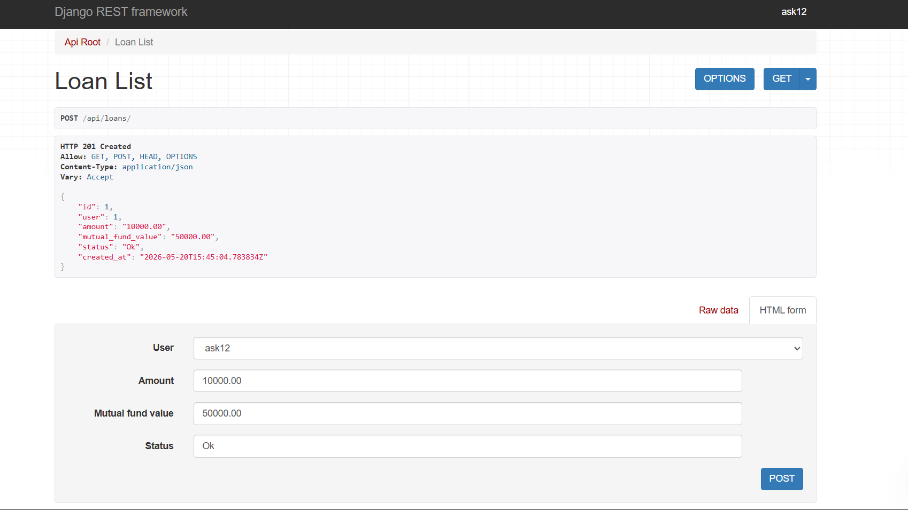
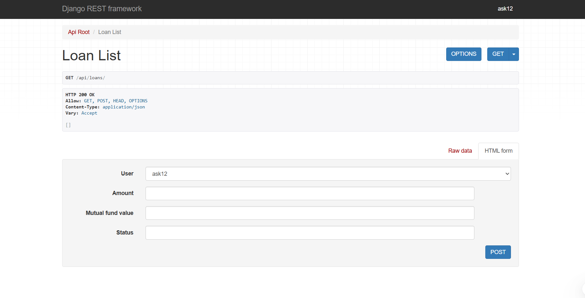
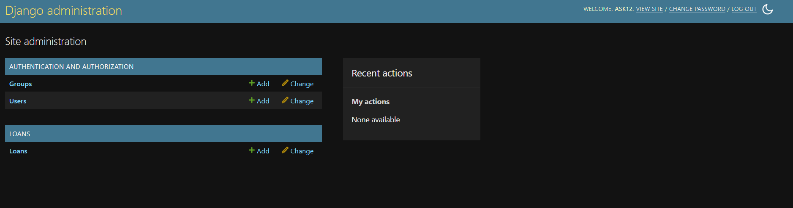
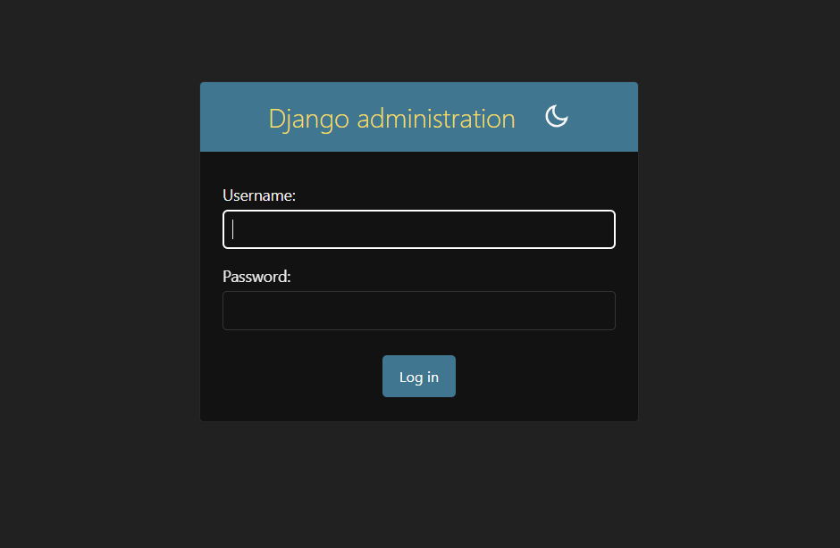

# Loan Processing API


A Django REST Framework-based backend system for managing fintech-style loan requests through REST APIs.

---

## Overview

This project is a backend-focused fintech prototype built using Django and Django REST Framework.

The system allows:
- Loan creation and tracking
- Loan status management
- REST API handling
- Modular backend architecture

The project was built to strengthen backend engineering and API development skills.

---

## Features

- RESTful API architecture
- Django ORM integration
- Loan request management
- Loan status handling
- Modular Django app structure
- SQLite database integration

---

## Tech Stack

- Python
- Django
- Django REST Framework
- SQLite

---

## Project Structure

```bash
loan-processing-api/
│
├── assets/
│
├── loans/
│   ├── models.py
│   ├── serializers.py
│   ├── views.py
│   ├── urls.py
│   └── migrations/
│
├── loan_processing_api/
│   ├── settings.py
│   ├── urls.py
│   └── wsgi.py
│
├── manage.py
├── requirements.txt
└── README.md
```

---

## Screenshots

### Loan API Example



---

### Loan List



---

### Django Admin Panel



---

### Admin Login



---

## API Endpoints

| Method | Endpoint | Description |
|--------|----------|-------------|
| GET | `/loans/` | Fetch all loans |
| POST | `/loans/` | Create a new loan |
| PUT | `/loans/{id}/` | Update loan details |
| DELETE | `/loans/{id}/` | Delete a loan |

---

## Engineering Decisions

- Used Django REST Framework for rapid API development
- Structured APIs modularly using serializers and views
- Designed backend architecture for future authentication and eligibility integration
- Used ORM-based models for maintainable database interaction

---

## Setup Instructions

### Clone the Repository

```bash
git clone https://github.com/Ashok-Kumar17/loan_processing_api.git
cd loan_processing_api
```

### Create Virtual Environment

```bash
python -m venv venv
```

### Activate Environment

Windows:

```bash
venv\\Scripts\\activate
```

Linux/Mac:

```bash
source venv/bin/activate
```

### Install Dependencies

```bash
pip install -r requirements.txt
```

### Run Migrations

```bash
python manage.py migrate
```

### Start Server

```bash
python manage.py runserver
```

---

## Learning Outcomes

This project helped in understanding:
- REST API development
- Django backend architecture
- ORM-based database handling
- Serializer-based API responses
- Backend modularization

---

## Future Improvements

- JWT Authentication
- PostgreSQL integration
- Swagger/OpenAPI documentation
- Docker deployment
- Unit testing
- Loan eligibility engine

---

## Author

Ashok Kumar Meena

Electrical Engineering, IIT Madras

Interested in Backend Engineering, Embedded Systems, Firmware, and Robotics Software.
